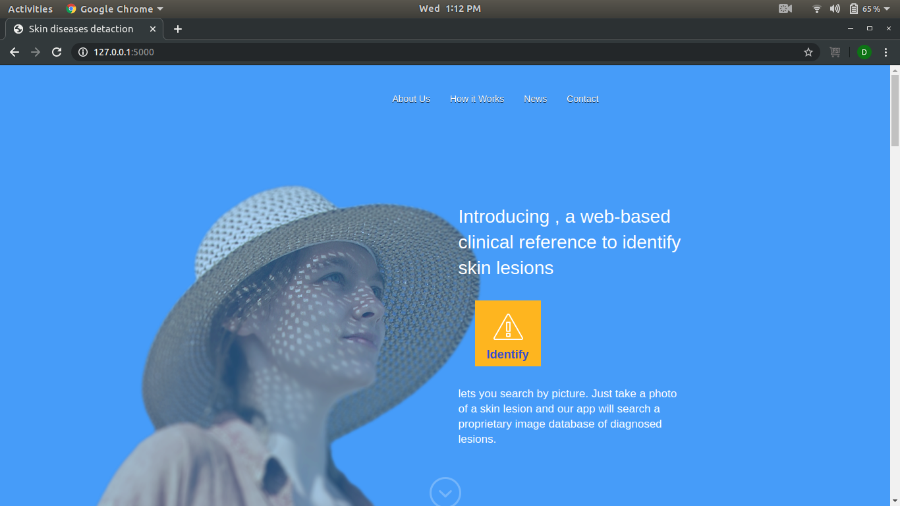
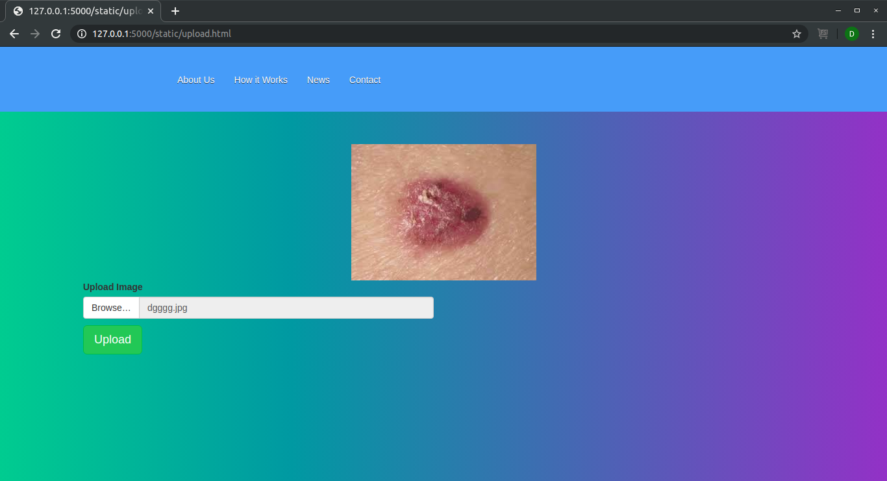
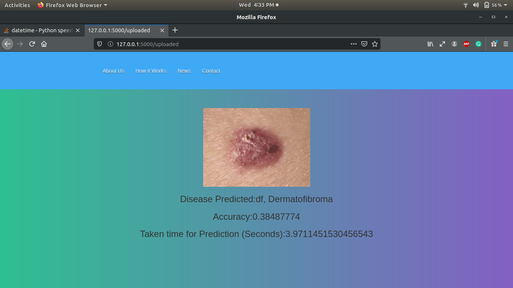

# Skin Disease Detection using AI at the Edge

Skin Disease Detection at edge predicts the disease of skin from the image of that infected part in less than one second and that's where AI at the Edge come.

This web app simply take a disease image using a web interface and give the disease name with accuracy and time taken for prediction.


## Getting Started


### Prerequisites
#### **Prerequisite 1**

- **Option 1**
    - 🍴 Fork this repo!

- **Option 2**
    - 👯 Clone this repo to your local machine using https://github.com/denilDG/skin-disease-detection-edge.git

#### Prerequisite 2
First make sure that you have installed the anaconda.<br />
See this [page](https://docs.anaconda.com/anaconda/install/) for installing anaconda. 

#### Prerequisite 3
Install the OpenVINO toolkit developed by Intel. OpenVINO toolkit is the secret behind AI at the Edge.<br />
See this [page](https://docs.openvinotoolkit.org/latest/index.html) for installing anaconda.

### Installing

#### Step 1
Create a new environment using anaconda:-

```
conda create -n <envname> python=3.7
```

For more information see [here](https://docs.conda.io/projects/conda/en/latest/user-guide/tasks/manage-environments.html)

#### Step 2
Activate the environment:-

```
conda activate <envname>
```
#### Step 3
Go to the project directory.<br />
Install all the requirements:-

```
pip install -r requirements.txt
```

## Running the app

#### Step 1
Activate the created environment:-

```
conda activate <envname>
```

#### Step 2
Activate the openvino source:- 

&lt;put your own openvino installation directory in the below command&gt;
  
```
source </opt/intel/openvino/bin>/setupvars.sh
```

#### Step 3
Open the terminal/cmd in project directory or use

```

cd <project_directory>
```

#### Step 4
Use the bundled `venv` and the updated OpenVINO APIs. CPU extension is no longer required.

#### Step 5
Now finally run the app.py file using python:-

```
python app.py
```

#### Step 6
Open the link as specified in terminal which would be like as shown in the picture:- 


So open the link shown as terminal here which is:- http://127.0.0.1:5000/

Home page will be like this:-



Click on the identify button of the page.

It will redirect you to upload page:-


Upload the skin disease image:-



Now click on the upload button.

It will give the result as shown in below picture:-


## Demo video

[](https://www.youtube.com/watch?v=PXgaFHic8eg)

## Comparision

Comparision of ***Time taken for prediction*** Skin disease detection at edge with normal skin disease detection system (https://github.com/denilDG/skin-disease-detection).

#### Skin Disease Detection using tensorflow weight files
<br /> <br />

##### Skin Disease Detection at edge
<br /> <br />

## Note:

### This model is not that much accurate. It's only for leaning the deployment of an web app using openvino and flask. 

## Model Conversion for OpenVINO 2025 (IR v10+)

If you see an error about loading `model/model_tf.xml` (IR v6), re-convert your original model to IR v10+ using the venv CLI:

1) Activate venv (PowerShell):
```
venv\Scripts\activate
```

2) Convert your source model with `ovc`:
```
# TensorFlow SavedModel example
ovc --saved_model_dir <PATH_TO_SAVEDMODEL> --output_dir model_new

# ONNX example
ovc --input_model <PATH_TO_MODEL>.onnx --output_dir model_new
```

3) Replace model files:
 - Copy `model_new/model.xml` and `model_new/model.bin` over `model/model_tf.xml` and `model/model_tf.bin`
 - Or update `MODEL` in `edge_app.py` to point to the new XML

4) Smoke test in venv:
```
venv\Scripts\python.exe test_model.py
```
